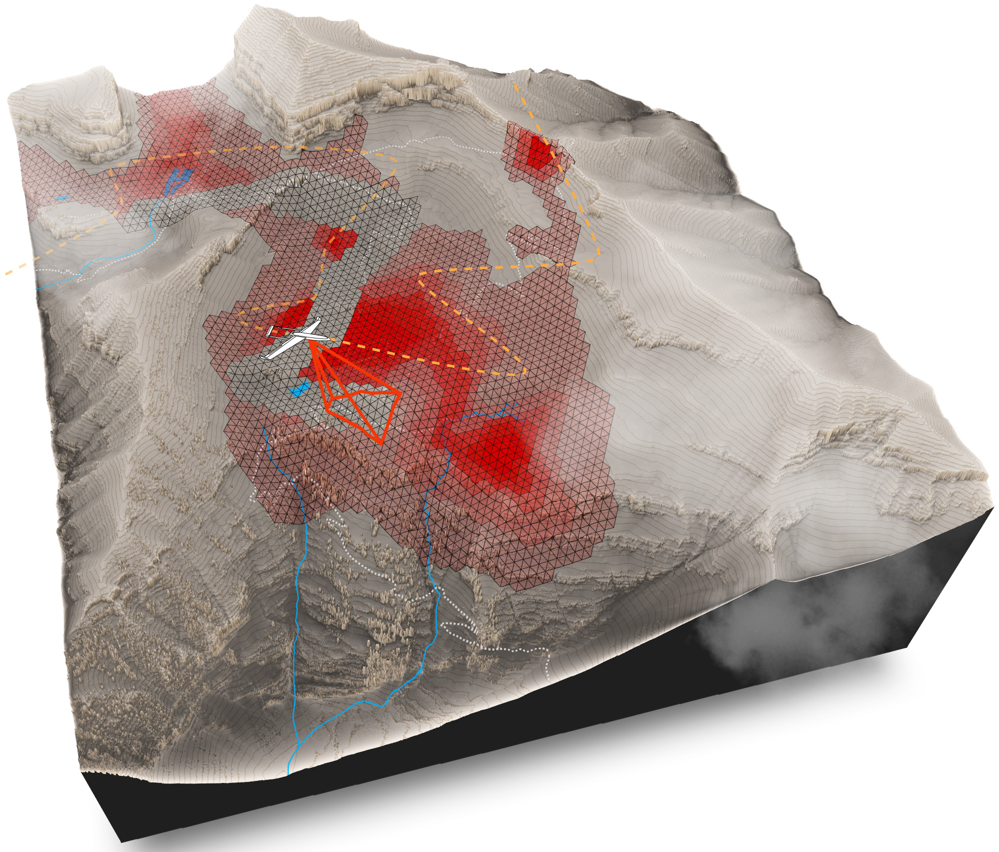

# TIGRIS: An Informed Sampling-based Algorithm for Informative Path Planning

This repository contains the instructions for running the code for TIGRIS. All code is contained within a Docker Image that can be obtained from DockerHub [here](https://hub.docker.com/r/bradygm/tigris) and the results can be visualized over rosbridge and WebViz. 

This code base allows for running Monte Carlo testing for batches of results as well as for specific starting conditions.

Authors: [Brady Moon](https://bradymoon.com/), [Satrajit Chatterjee](https://github.com/satrajit-chatterjee), and [Sebastian Scherer](https://www.ri.cmu.edu/ri-faculty/sebastian-scherer/)

## Table of Contents

1. [Overview](#overview)
2. [Setup and Usage](#usage)
3. [General Tips and Troubleshooting](#tips)
4. [Citation](#citation)

## Overview [[Video]](https://youtu.be/bMw5nUGL5GQ) <a name="overview"></a>


Abstract: Informative path planning is an important and challenging problem in robotics that remains to be solved in a manner that allows for wide-spread implementation and real-world practical adoption. Among various reasons for this, one is the lack of approaches that allow for informative path planning in high-dimensional spaces and non-trivial sensor constraints. In this work we present a sampling-based approach that allows us to tackle the challenges of large and high-dimensional search spaces. This is done by performing informed sampling in the high-dimensional continuous space and incorporating potential information gain along edges in the reward estimation. This method rapidly generates a global path that maximizes information gain for the given path budget constraints. We discuss the details of our implementation for an example use case of searching for multiple objects of interest in a large search space using a fixed-wing UAV with a forward-facing camera. We compare our approach to a sampling-based planner baseline and demonstrate how our contributions allow our approach to consistently out-perform the baseline by 18.0%. With this we thus present a practical and generalizable informative path planning framework that can be used for very large environments, limited budgets, and high dimensional search spaces, such as robots with motion constraints or high-dimensional configuration spaces. 

The paper can be found [here](https://arxiv.org/abs/2203.12830).


## Setup and Usage <a name="usage"></a>

The high-level steps to interact with the docker is to:
1. [Get the Docker image](#dockersetup)
2. Launch the [Webviz App](https://webviz.io/app/)
3. [Copy and paste the Webviz config](#webvizconfig)
4. [Launch the container and run the code](#rosmsg)

### Get the Docker image

We provide a prebuilt [docker image](https://hub.docker.com/r/bradygm/tigris), which allow you to replicate our setup. The docker image contains everything to run TIGRIS. Here are the steps to build the docker image.

1. Install docker. You can find online tutorials and docs [here](https://docs.docker.com/).
2. Pull the image from DockerHub with

```
docker pull bradygm/tigris
```


### Setting Up Webviz <a name="webvizconfig"></a>

Follow these steps to configure the [Webviz App](https://webviz.io/app/) to render the visualizations

1. Locate the included file `layout.json`
2. Open the file and copy all its contents to your clipboard
3. Navigate to the tab where you have the [Webviz App](https://webviz.io/app) open. **NOTE: Webviz works best with Google Chrome. Other browsers may fail to render Webviz correctly**
4. Click on the `config` button located at the top right and then click on `import/export JSON`

5. Paste the config into the popup window


### Launch the container and run the code <a name="rosmsg"></a>

Run the docker image and launch the code with 
```
sudo docker run -dp 9090:9090 tigris
roslaunch tigris tigris.launch
```

After this, Webviz should connect over rosbridge. 

In the upper right config panel, click the green "Publish" button at the bottom left, and the planner will begin running. The bottom right panel will give updates on the planner progress and parameters. The panel on the left will show the planned path. 

#### Configuration

In the default conditions, a random configuration of target priors is sampled and are not taken from the plan request. In order to set the target priors in the plan according to the plan request, set `random_plans:=false` in the roslaunch command. 

The plan request parameters include the following:
* `start_pose`: The starting pose for the plan
* `max_planning_time`: How much time is given to the planner
* `budget`: The max length of the planned path
* `counter_detection_range`: The distance to stay away from target priors
* `target_prior`: A vector of target priors

Target priors have the following properties:
* `pose`: Pose of the target
* `confidence`: Value between 0 and 1 of the probability of a target being at the pose
* `std_dev`: The standard deviation for the Gaussian kernel used for initializing the grid values at the pose

In order to call the planner many times, the number of batches can be set with `number_of_batches:=<number_of_batches>` and the number of runs per batch with `number_of_runs:=<number_of_runs>`. You can also skip having to send a plan request with `start_with_replan:=true`.

Other roslaunch parameters include the following
* `planning_time`: How much time is given to the planner
* `budget`: The max length of the planned path
* `extend_dist`: The distance the tree is extended toward a feasible point
* `extend_radius`: The radius for all neighbors that extend to a feasible point
* `prune_radius`: The radius used for the pruning condition
* `counterdetect_radius`: The distance to stay away from target priors
* `width`: Width of the sensor
* `height`: Height of the sensor
* `focal_length`: Focal length of the sensor
* `pitch`: Pitch of the camera
* `X_START`: X start position of the grid
* `X_END`: X end position of the grid
* `Y_START`: Y start position of the grid
* `Y_END`: Y end position of the grid
* `RESOLUTION`: The length and width of each grid cell
* `initial_confidence`: A value between 0 and 1 as the initial confidence for all grid cells


### General Tips and Troubleshooting <a name="tips"></a>

#### Webviz unresponsive when publishing a path
Sometimes Webviz will become unresponsive, especially if restarting the docker container and reestablishing the connection. If nothing happens when you click "Publish", try

1. Refreshing the Webviz page
2. Copying your previous message JSON, clicking on a new message template in the Datatype selection box, reselecting the `planner_map_interfaces/PlanningRequest` message, and pasting in your old message.


#### Getting good quality final paths
In general, longer planning time will lead to better paths. 

If the counter detection radius it too large, then the UAV will not be able to optimally view the prior targets. 


## Citation <a name="usage"></a>
If you have questions about TIGRIS, please contact [bradym@andrew.cmu.edu](mailto:bradym@andrew.cmu.edu)

You can cite this work with the following:
```
@inproceedings{moon2022tigris,
  doi = {10.48550/ARXIV.2203.12830},
  url = {https://arxiv.org/abs/2203.12830.pdf},
  author = {Moon, Brady and Chatterjee, Satrajit and Scherer Sebastian},
  title = {TIGRIS: An Informed Sampling-based Algorithm for Informative Path Planning},
  publisher = {arXiv},
  booktitle = {IEEE/RSJ International Conference on Intelligent Robots and Systems (IROS)},
  year = {2022},
  video = {https://youtu.be/bMw5nUGL5GQ}
}
```
